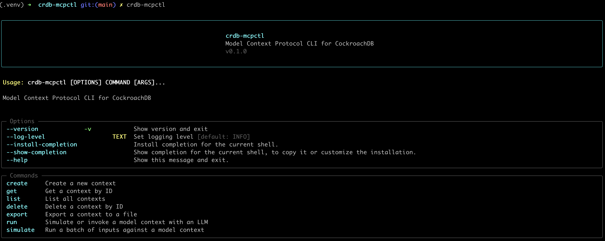

# cockroachdb-mcp-client

[](https://pypi.org/project/cockroachdb-mcp-client/)
[](https://pypi.org/project/cockroachdb-mcp-client/)
[](https://github.com/viragtripathi/cockroachdb-mcp-client/blob/main/LICENSE)
[](https://github.com/viragtripathi/cockroachdb-mcp-client/actions)

A developer-friendly, model-provider-agnostic CLI tool for working with [Model Context Protocol](https://modelcontextprotocol.io) servers — built specifically for use with [CockroachDB](https://www.cockroachlabs.com/) backends.



---

## 🧠 What This Is

`cockroachdb-mcp-client` is a spec-aligned, CLI-first interface for creating, managing, exporting, and running [Model Context Protocol](https://modelcontextprotocol.io) resources.

It works with [`cockroachdb-mcp-server`](https://github.com/viragtripathi/cockroachdb-mcp-server), a FastAPI-based MCP implementation backed by CockroachDB. Together, they offer:

- A reliable MCP context registry (server)
- A CLI for simulation, LLM runs, and batch workflows (client)

---

## ✅ Feature Highlights

- 🌱 MCP-spec-compliant context management (create, list, get, delete)
- 📦 Export individual or all contexts to YAML or JSON
- 🔁 Run contexts against real LLMs (OpenAI, Anthropic, etc.)
- 💬 Supports streaming, retry, model override
- 📚 Batch simulation of inputs
- ⚙️ Reads config from `~/.config/cockroachdb-mcp-client/config.yaml` or env vars
- 🧱 Extensible provider system (Claude, GPT-4, Mistral, etc.)
- 📈 Configurable logging per command (`--log-level`)

---

## 🚀 Quickstart

### 📦 Install from PyPI

```bash
pip install cockroachdb-mcp-client
````

### 🛠 Or install from source

```bash
git clone https://github.com/viragtripathi/cockroachdb-mcp-client
cd cockroachdb-mcp-client
pip install -e .
```

> You’ll also need a running instance of [`cockroachdb-mcp-server`](https://github.com/viragtripathi/cockroachdb-mcp-server)

---

## 🔐 Configuration Options

### ✅ Environment Variables (preferred for CI and scripting)

| Variable            | Description                          |
|---------------------|--------------------------------------|
| `MCP_SERVER_URL`    | Base URL for the MCP server          |
| `MCP_API_TOKEN`     | Bearer token for protected endpoints |
| `OPENAI_API_KEY`    | API key for OpenAI LLMs              |
| `ANTHROPIC_API_KEY` | API key for Anthropic Claude LLMs    |

```bash
export MCP_SERVER_URL=http://localhost:8081
export OPENAI_API_KEY=sk-...
```

---

### 🗂 `~/.config/cockroachdb-mcp-client/config.yaml` (alternative for local/dev)

```yaml
server: http://localhost:8081

openai:
  api_key: sk-...

anthropic:
  api_key: your-anthropic-key
```

✅ Env vars take precedence over config file.

---

## 🧪 CLI Commands

```bash
# Show version and top-level help
cockroachdb-mcp-client --version
cockroachdb-mcp-client --help

# Create a context
cockroachdb-mcp-client create context --file summarizer.yaml

# List all contexts
cockroachdb-mcp-client list contexts

# Get or delete a context
cockroachdb-mcp-client get context <uuid>
cockroachdb-mcp-client delete context <uuid> -y

# Export one or all
cockroachdb-mcp-client export context <uuid> --file out.yaml
cockroachdb-mcp-client export all --output-dir exported_contexts/

# Run a single input
cockroachdb-mcp-client run context --provider openai --file context.yaml --input "Summarize this article"

# Simulate a batch of inputs
cockroachdb-mcp-client simulate context \
  --provider anthropic \
  --file summarizer.yaml \
  --inputs inputs.txt
```

---

## 🧰 Logging

Enable structured logging with:

```bash
cockroachdb-mcp-client create context --file ctx.yaml --log-level DEBUG
```

---

## ♻️ Retry Logic

All network operations (GET, POST, DELETE) retry up to 3 times with 2s backoff using [`tenacity`](https://tenacity.readthedocs.io/).

---

## 💡 Error Feedback Example

On connection failure:

```text
❌ Failed to connect to MCP server at http://localhost:8081

🔧 Is the server running? Start it with:
  cockroachdb-mcp-server serve --init-schema

🌍 To override the server URL:
  --server http://localhost:8081
  OR
  export MCP_SERVER_URL=http://localhost:8081
```

---

## 🙌 Contributions

This project is open for internal and public usage.

If you want to support additional providers, improve UX, or standardize context specs, contributions are welcome.

